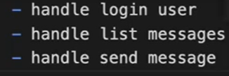

# react.JS

1. create-react-app

   - support-desk-app make file
   - npx create-react-app frontend
   - layout 만들거임 react-bootstrap bootstrap

2. add routing npm install react-router-dom
   -create home page
   -admin page
3. 챗박스
   -chat with us
4. socket.io server
   

install express socket.io
install http
install -D nodemon

5. socket server 만들기
   

6. 끝내기
   

7. 관지자 계시판
   
8. heroku 등록
   
